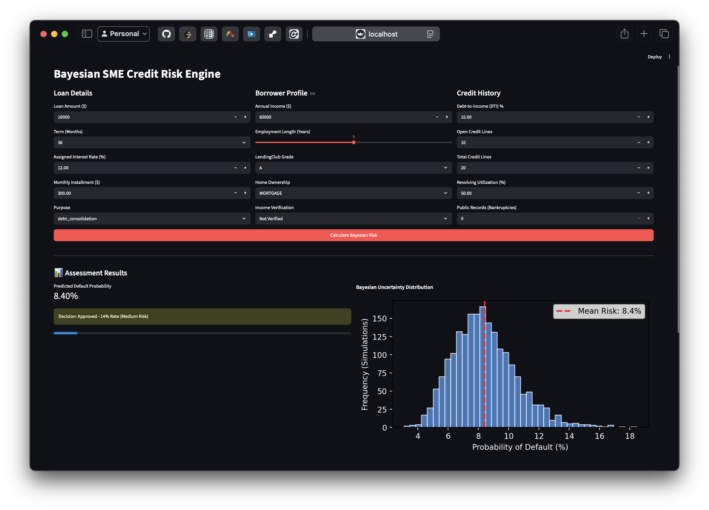

# Bayesian Credit Risk Engine



## Overview
The Bayesian Credit Risk Engine is a probabilistic machine learning application designed to assess the default risk of SME loans. Instead of providing a single rigid prediction, this model uses Bayesian inference (MCMC sampling) to calculate a full probability distribution of an applicant's risk, allowing for smarter, dynamic interest rate pricing based on uncertainty.

## Key Features
* **Probabilistic Predictions:** Calculates exact default probability percentages using PyMC.
* **Dynamic Loan Pricing:** Automatically assigns interest rates (e.g., 8%, 14%, 22%) based on defined risk thresholds.
* **Uncertainty Visualization:** Displays Bayesian posterior distributions to visualize the engine's confidence in its decision.
* **Interactive UI:** A fully featured Streamlit dashboard for real-time applicant evaluation.

## Tech Stack
* **Core ML:** PyMC, ArviZ, Scikit-Learn, NumPy, Pandas
* **Frontend UI:** Streamlit, Matplotlib

## Project Structure
* `main.py` - The backend engine. Cleans the data, runs the MCMC simulations, and exports the learned weights.
* `dashboard.py` - The interactive frontend. Loads the saved model and evaluates new applicants in real-time.
* `src/` - Helper modules for data fetching and cleaning.
* `model/` - Storage for the compiled NetCDF (`.nc`) model and scaling `.pkl` files (ignored in git).
* `data/` - Raw datasets and asset storage.

## How to Run

1. **Install Dependencies:**
   Ensure you have Python installed, then run:
   ```bash
   pip install pymc arviz streamlit scikit-learn pandas numpy matplotlib joblib kagglehub
   ```

2. **Train the Model:**
Generate the model weights and data scalers (this will create the `model/` directory):
    ```bash
    python main.py
    ```
3. **Launch the Dashboard:**
Start the interactive web interface:
    ```bash
    streamlit run dashboard.py
    ```